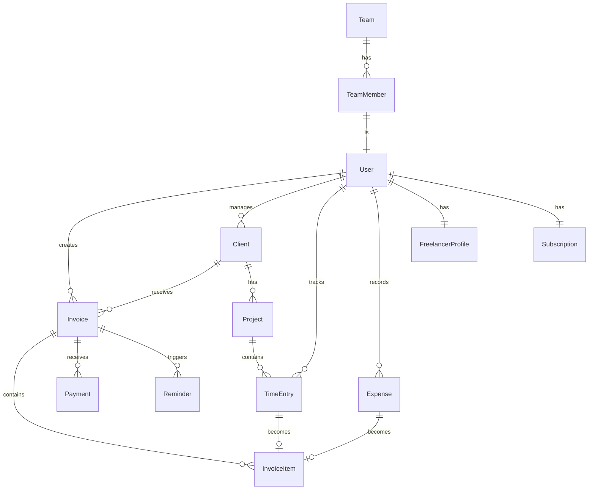

# Product Requirements Document: InvoiceFlow Pro
## Freelancer Invoice Management SaaS Platform

**Document Version:** 1.0  
**Date:** January 2025  
**Status:** Draft for Review  
**Author:** Senior Business Analyst & Product Strategist

---

## Executive Summary

### Product Vision
InvoiceFlow Pro is a modern, AI-powered invoice management platform designed specifically for freelancers, consultants, and small creative agencies. Unlike enterprise-focused solutions like QuickBooks or the SMB-oriented FreshBooks, InvoiceFlow Pro focuses on solo professionals and micro-teams (1-5 people) who need streamlined invoicing, intelligent payment tracking, and automated financial workflows without unnecessary complexity.

### Market Opportunity
The global freelance economy represents 1.57 billion people (47% of the global workforce) with a market value exceeding $1.5 trillion annually. Current solutions are either:
- **Over-engineered** (QuickBooks): Built for SMBs with accounting departments
- **Feature-bloated** (FreshBooks): Trying to serve everyone from freelancers to 50-person companies
- **Too simple** (Wave, Invoice Ninja): Lacking automation and intelligence features

InvoiceFlow Pro targets the underserved segment of professional freelancers earning $50K-$500K annually who need sophisticated features without enterprise complexity.

### Key Differentiators
1. **AI-Powered Invoice Intelligence**: Automatic invoice generation from project tracking
2. **Smart Payment Predictions**: ML-based cash flow forecasting
3. **Client Health Scoring**: Predictive analytics for payment delays
4. **Workflow Automation**: Template-based recurring invoices with smart adjustments
5. **Integrated Time & Expense Tracking**: Seamless project-to-invoice conversion

---

## 1. Market Analysis

### 1.1 Market Size and Growth
- **Total Addressable Market (TAM):** $8.2 billion (freelance financial management software)
- **Serviceable Addressable Market (SAM):** $2.4 billion (professional freelancers in US/EU/UK)
- **Serviceable Obtainable Market (SOM):** $120 million (5% market share in 5 years)
- **Growth Rate:** 22% CAGR through 2028

### 1.2 Competitive Landscape

#### Direct Competitors

| Competitor | Strengths | Weaknesses | Pricing | Market Share |
|------------|-----------|------------|---------|--------------|
| **FreshBooks** | Brand recognition, feature-rich, good UX | Expensive, complex for solopreneurs | $15-50/month | 28% |
| **QuickBooks Self-Employed** | Intuit ecosystem, tax integration | Overwhelming features, poor mobile | $15-25/month | 35% |
| **Wave** | Free tier, simple interface | Limited features, poor support | Free-$16/month | 18% |
| **Invoice Ninja** | Open source option, customizable | Dated UI, limited automation | $10-24/month | 8% |
| **Bonsai** | Contract integration, proposals | Limited accounting features | $16-52/month | 6% |

#### Competitive Advantages
1. **Pricing Sweet Spot**: $9-29/month (40% below FreshBooks)
2. **AI/ML Differentiation**: No competitor offers predictive payment analytics
3. **Mobile-First Design**: 70% of freelancers work remotely/mobile
4. **Vertical Focus**: Deep features for creative/tech freelancers
5. **API-First Architecture**: Better integration ecosystem

### 1.3 Market Trends
- **Trend 1**: 58% increase in freelance workforce post-COVID
- **Trend 2**: AI adoption in financial tools growing 45% YoY
- **Trend 3**: Mobile invoicing usage up 73% since 2022
- **Trend 4**: Real-time payments becoming standard (expect 80% by 2027)
- **Trend 5**: Compliance automation demand (tax reporting, 1099s)

---

## 2. User Personas

### 2.1 Primary Persona: "Sarah the Designer"
**Demographics:**
- Age: 28-35
- Income: $75K-$150K/year
- Location: Urban/suburban
- Tech Savvy: High
- Clients: 5-15 active

**Pain Points:**
- Spends 6+ hours/month on invoicing
- 23% of invoices paid late
- Manual time tracking across projects
- No visibility into cash flow
- Struggles with tax planning

**Jobs to be Done:**
1. Create and send professional invoices quickly
2. Track payment status without manual follow-ups
3. Understand monthly cash flow at a glance
4. Automate recurring client invoices
5. Export data for tax preparation

**Success Metrics:**
- Reduce invoicing time by 70%
- Improve payment speed by 5 days
- Zero missed billable hours
- 90% invoice automation rate

### 2.2 Secondary Persona: "Marcus the Consultant"
**Demographics:**
- Age: 35-45
- Income: $150K-$500K/year
- Location: Any (travels frequently)
- Tech Savvy: Medium
- Clients: 3-8 enterprise

**Pain Points:**
- Complex approval chains delay payments
- Multiple currencies and tax jurisdictions
- Detailed expense tracking requirements
- Project budget tracking across phases
- Professional report generation for clients

**Jobs to be Done:**
1. Handle multi-currency invoicing
2. Track project budgets vs actuals
3. Generate professional financial reports
4. Manage complex payment terms
5. Integrate with enterprise procurement systems

### 2.3 Tertiary Persona: "Alex the Dev Agency"
**Demographics:**
- Team Size: 2-5 people
- Revenue: $250K-$1M/year
- Location: Remote-first
- Tech Savvy: Very High
- Clients: 10-20 active

**Pain Points:**
- Team time tracking coordination
- Project profitability analysis
- Client-specific rate management
- Subcontractor payment workflows
- Revenue sharing calculations

---

## 3. Feature Specifications

### 3.1 Core Features (MVP - Month 1-3)

#### F1: Smart Invoice Creation
**Description:** AI-powered invoice generation with intelligent defaults

**Acceptance Criteria:**
- Create invoice in <30 seconds
- Auto-populate from time tracking
- Smart line item suggestions based on history
- Custom branding with logo/colors
- Multiple template support
- PDF and link-based delivery

**Technical Requirements:**
- React component library for invoice builder
- PDF generation service (Puppeteer)
- Template storage in PostgreSQL
- Real-time preview with Next.js

#### F2: Payment Tracking & Automation
**Description:** Automated payment monitoring and follow-ups

**Acceptance Criteria:**
- Real-time payment status updates
- Automated payment reminders (customizable schedule)
- Partial payment tracking
- Payment method management (ACH, card, wire)
- Thank you messages on payment
- Overdue invoice escalation

**Technical Requirements:**
- Stripe Connect integration
- Webhook processing for payment events
- Background job queue (Bull/Redis)
- Email service integration (SendGrid)

#### F3: Client Portal
**Description:** Self-service portal for clients to view/pay invoices

**Acceptance Criteria:**
- Passwordless authentication (magic links)
- Invoice history view
- One-click payment processing
- Download receipts/statements
- Dispute/query messaging
- Custom domain support (white-label)

**Technical Requirements:**
- Separate Next.js app for portal
- Shared database with main app
- Stripe Checkout integration
- CDN for static assets

#### F4: Time & Expense Tracking
**Description:** Integrated tracking that feeds into invoices

**Acceptance Criteria:**
- Start/stop timer with project selection
- Manual time entry with descriptions
- Expense capture with receipt photos
- Mileage tracking (mobile GPS)
- Billable/non-billable categorization
- Weekly timesheet approval workflow

**Technical Requirements:**
- Mobile app (React Native)
- Image storage (S3)
- OCR for receipt processing (Textract)
- GPS/location services integration

### 3.2 Advanced Features (Month 4-6)

#### F5: AI-Powered Insights
**Description:** Machine learning for payment predictions and client health

**Acceptance Criteria:**
- Payment date predictions (±3 days accuracy)
- Client payment health scores
- Cash flow forecasting (30/60/90 days)
- Invoice optimization suggestions
- Anomaly detection for unusual charges
- Best time to send invoice recommendations

**Technical Requirements:**
- ML pipeline (Python/TensorFlow)
- Feature store for model training
- Real-time inference API
- Data warehouse (Snowflake/BigQuery)

#### F6: Financial Reporting Suite
**Description:** Comprehensive financial analytics and reports

**Acceptance Criteria:**
- P&L statements
- Cash vs accrual reporting
- Tax summary reports (1099 prep)
- Project profitability analysis
- Client lifetime value tracking
- Custom report builder

**Technical Requirements:**
- Business intelligence tool (Metabase)
- Report scheduling system
- Export to Excel/PDF/CSV
- Data aggregation pipelines

#### F7: Workflow Automation
**Description:** Rules-based automation for repetitive tasks

**Acceptance Criteria:**
- Recurring invoice automation
- Conditional invoice generation
- Multi-step approval workflows
- Auto-categorization of expenses
- Smart reminder sequences
- Integration with Zapier/Make

**Technical Requirements:**
- Workflow engine (Temporal/Camunda)
- Rules engine for conditions
- API webhooks for integrations
- Event-driven architecture

### 3.3 Premium Features (Month 7-12)

#### F8: Advanced Integrations
- QuickBooks sync (two-way)
- Xero integration
- Banking APIs (Plaid)
- Project management tools (Asana, Trello, Jira)
- Calendar integration (Google, Outlook)
- Slack/Teams notifications
- CRM systems (HubSpot, Pipedrive)

#### F9: Team Collaboration
- Role-based permissions (Owner, Admin, Member, Accountant)
- Team time tracking dashboard
- Revenue sharing calculations
- Subcontractor management
- Internal approval workflows
- Team performance analytics

#### F10: Enterprise Features
- SSO/SAML authentication
- Advanced audit logs
- Custom data retention policies
- API rate limit increases
- Dedicated account management
- SLA guarantees
- White-label options

---

## 4. Technical Architecture

### 4.1 SaaS Starter Foundation Leverage

#### Existing Components to Utilize:
1. **Authentication System (NextAuth)**
   - Extend for client portal access
   - Add magic link authentication
   - Implement team invitations

2. **Stripe Integration**
   - Leverage subscription management
   - Extend for Stripe Connect (client payments)
   - Add usage-based billing tiers

3. **Dashboard Framework**
   - Adapt CRUD operations for invoices
   - Extend RBAC for team permissions
   - Utilize existing data tables

4. **Database Schema (Prisma)**
   - Extend user model for freelancer profiles
   - Add invoice, client, payment models
   - Leverage team management structure

5. **Deployment Configuration**
   - Use existing CI/CD pipelines
   - Leverage monitoring setup
   - Extend for multi-tenant architecture

### 4.2 New Technical Components

#### Database Schema Extensions:
```prisma
model Invoice {
  id              String   @id @default(cuid())
  number          String   @unique
  userId          String
  clientId        String
  status          InvoiceStatus
  issueDate       DateTime
  dueDate         DateTime
  subtotal        Decimal
  tax             Decimal
  total           Decimal
  currency        String   @default("USD")
  items           InvoiceItem[]
  payments        Payment[]
  reminders       Reminder[]
  createdAt       DateTime @default(now())
  updatedAt       DateTime @updatedAt
  
  user            User     @relation(fields: [userId], references: [id])
  client          Client   @relation(fields: [clientId], references: [id])
}

model Client {
  id              String   @id @default(cuid())
  userId          String
  name            String
  email           String
  company         String?
  address         Json?
  taxId           String?
  paymentTerms    Int      @default(30)
  preferredMethod PaymentMethod
  healthScore     Float?
  invoices        Invoice[]
  projects        Project[]
  
  user            User     @relation(fields: [userId], references: [id])
}

model TimeEntry {
  id              String   @id @default(cuid())
  userId          String
  projectId       String?
  description     String
  startTime       DateTime
  endTime         DateTime?
  duration        Int?
  billable        Boolean  @default(true)
  rate            Decimal?
  invoiceItemId   String?
  
  user            User     @relation(fields: [userId], references: [id])
  project         Project? @relation(fields: [projectId], references: [id])
  invoiceItem     InvoiceItem? @relation(fields: [invoiceItemId], references: [id])
}
```

#### API Architecture:
```typescript
// Core API Routes (Next.js App Router)
/api/invoices
  GET    - List invoices (filtered, paginated)
  POST   - Create new invoice
  
/api/invoices/[id]
  GET    - Get invoice details
  PUT    - Update invoice
  DELETE - Delete invoice
  
/api/invoices/[id]/send
  POST   - Send invoice to client
  
/api/invoices/[id]/payments
  POST   - Record payment
  GET    - List payments
  
/api/clients
  Full CRUD operations
  
/api/time-entries
  POST   - Start/stop timer
  GET    - List entries
  PUT    - Update entry
  
/api/reports
  GET /revenue - Revenue reports
  GET /aging   - Aging reports
  GET /tax     - Tax summaries
  
/api/webhooks/stripe
  POST   - Handle Stripe events
```

### 4.3 Technology Stack

#### Frontend:
- **Framework**: Next.js 14 (App Router)
- **UI Library**: shadcn/ui + Tailwind CSS
- **State Management**: Zustand + React Query
- **Forms**: React Hook Form + Zod
- **Charts**: Recharts
- **PDF Generation**: React-PDF
- **Mobile**: React Native (shared components)

#### Backend:
- **Runtime**: Node.js 20+
- **API**: Next.js API Routes + tRPC
- **Database**: PostgreSQL (Supabase/Neon)
- **ORM**: Prisma 5
- **Queue**: Bull + Redis
- **File Storage**: AWS S3 / Cloudflare R2
- **Email**: Resend / SendGrid

#### Infrastructure:
- **Hosting**: Vercel (primary) + AWS Lambda
- **CDN**: Cloudflare
- **Monitoring**: Sentry + Datadog
- **Analytics**: PostHog + Mixpanel
- **Search**: Algolia / Meilisearch

### 4.4 Security Requirements

1. **Data Encryption**
   - AES-256 for data at rest
   - TLS 1.3 for data in transit
   - Client-side encryption for sensitive data

2. **Compliance**
   - SOC 2 Type II certification
   - GDPR compliance (EU)
   - CCPA compliance (California)
   - PCI DSS for payment processing

3. **Access Control**
   - Multi-factor authentication
   - IP whitelisting (enterprise)
   - Session management
   - API rate limiting

4. **Audit & Monitoring**
   - Comprehensive audit logs
   - Real-time threat detection
   - Automated security scanning
   - Incident response plan

### 4.5 Performance Requirements

- **Page Load**: <1.5s (P95)
- **API Response**: <200ms (P95)
- **Invoice Generation**: <2s
- **Search Response**: <100ms
- **Uptime SLA**: 99.9%
- **Database Queries**: <50ms (P95)
- **Concurrent Users**: 10,000+
- **Storage**: 10GB per user

---

## 5. Go-to-Market Strategy

### 5.1 Pricing Strategy

#### Pricing Tiers:

| Tier | Price | Clients | Invoices | Features | Target |
|------|-------|---------|----------|----------|--------|
| **Starter** | $9/mo | 5 | 20/mo | Core features, 1 user | New freelancers |
| **Professional** | $19/mo | 25 | 100/mo | + AI insights, automation | Established freelancers |
| **Business** | $39/mo | Unlimited | Unlimited | + Team features, API | Agencies |
| **Enterprise** | Custom | Unlimited | Unlimited | + SSO, SLA, white-label | Large agencies |

#### Pricing Psychology:
- **Freemium**: 3 clients, 5 invoices/month (convert at limits)
- **Annual Discount**: 20% (2.4 months free)
- **Usage-Based Add-ons**: $0.50 per invoice over limit
- **Partner Program**: 30% recurring commission

### 5.2 Customer Acquisition Strategy

#### Phase 1: Product-Led Growth (Month 1-6)
1. **Free Tier**: Aggressive limits to drive conversion
2. **Content Marketing**: SEO-optimized guides and calculators
3. **Template Library**: 100+ free invoice templates
4. **Chrome Extension**: Time tracking browser extension
5. **Product Hunt Launch**: Target #1 Product of the Day

#### Phase 2: Community Building (Month 4-9)
1. **Freelancer Community**: Discord/Slack community (10K members)
2. **Educational Content**: YouTube channel, webinars
3. **Influencer Partnerships**: Top freelancer influencers
4. **Referral Program**: 3 months free for referrer and referee
5. **Integration Marketplace**: Featured in Zapier, Make directories

#### Phase 3: Channel Partnerships (Month 7-12)
1. **Co-marketing**: Partner with project management tools
2. **Reseller Program**: Web agencies, consultants
3. **Accounting Firms**: Referral partnerships
4. **Banking Partners**: Embedded in business banking apps
5. **Coworking Spaces**: Member benefits programs

### 5.3 Success Metrics & KPIs

#### Business Metrics:
- **MRR Growth**: 20% MoM (Year 1)
- **CAC Payback**: <6 months
- **LTV:CAC Ratio**: >3:1
- **Gross Margin**: >80%
- **NPS Score**: >50

#### Product Metrics:
- **Trial-to-Paid**: >15%
- **Monthly Churn**: <5%
- **DAU/MAU**: >60%
- **Feature Adoption**: >40% using automation
- **Mobile Usage**: >50% of sessions

#### Operational Metrics:
- **Support Response**: <2 hours
- **CSAT Score**: >90%
- **Bug Resolution**: <24 hours (critical)
- **Deploy Frequency**: Daily
- **System Uptime**: >99.9%

### 5.4 Launch Timeline

#### Pre-Launch (Month -2 to 0)
- Beta testing with 100 users
- Content creation (50 blog posts)
- Social media presence building
- Email list building (5,000 subscribers)
- Press kit and media outreach

#### Launch Phase (Month 1-3)
- Product Hunt launch
- AppSumo lifetime deal
- Influencer campaigns
- Paid ads (Google, Facebook)
- Webinar series

#### Growth Phase (Month 4-12)
- A/B testing and optimization
- Feature expansion based on feedback
- International expansion (UK, EU)
- Enterprise sales team
- Series A fundraising

---

## 6. SaaS Starter Integration Plan

### 6.1 Phase 1: Foundation (Week 1-2)

#### Authentication Extension:
```typescript
// Extend NextAuth configuration
export const authOptions: NextAuthOptions = {
  // ... existing config
  callbacks: {
    session: async ({ session, token }) => {
      // Add freelancer profile data
      session.user.freelancerProfile = await getFreelancerProfile(token.sub);
      session.user.subscription = await getSubscriptionDetails(token.sub);
      return session;
    },
  },
};

// Add magic link provider for client portal
providers: [
  // ... existing providers
  EmailProvider({
    server: process.env.EMAIL_SERVER,
    from: process.env.EMAIL_FROM,
    maxAge: 24 * 60 * 60, // 24 hours
  }),
];
```

#### Database Schema Integration:
```prisma
// Extend existing User model
model User {
  // ... existing fields
  freelancerProfile FreelancerProfile?
  invoices         Invoice[]
  clients          Client[]
  timeEntries      TimeEntry[]
  expenses         Expense[]
  subscription     Subscription? @relation(fields: [subscriptionId], references: [id])
}

model FreelancerProfile {
  id               String   @id @default(cuid())
  userId           String   @unique
  businessName     String?
  taxId            String?
  defaultCurrency  String   @default("USD")
  invoicePrefix    String   @default("INV")
  nextInvoiceNumber Int     @default(1)
  paymentTerms     Int      @default(30)
  logo             String?
  brandColors      Json?
  
  user             User     @relation(fields: [userId], references: [id])
}
```

### 6.2 Phase 2: Core Features (Week 3-6)

#### Dashboard Adaptation:
```typescript
// Leverage existing dashboard components
import { DataTable } from "@/components/ui/data-table";
import { Card, CardContent, CardHeader } from "@/components/ui/card";

export function InvoiceDashboard() {
  return (
    <DashboardLayout>
      <DashboardHeader title="Invoices" />
      
      {/* Revenue metrics cards */}
      <div className="grid gap-4 md:grid-cols-4">
        <MetricCard title="Total Revenue" value={revenue} />
        <MetricCard title="Outstanding" value={outstanding} />
        <MetricCard title="Overdue" value={overdue} />
        <MetricCard title="This Month" value={monthlyRevenue} />
      </div>
      
      {/* Reuse DataTable with invoice columns */}
      <DataTable
        columns={invoiceColumns}
        data={invoices}
        searchKey="number"
        filters={invoiceFilters}
      />
    </DashboardLayout>
  );
}
```

#### Stripe Integration Extension:
```typescript
// Extend Stripe service for client payments
export class PaymentService extends BaseStripeService {
  async createConnectedAccount(userId: string) {
    const account = await stripe.accounts.create({
      type: 'express',
      capabilities: {
        card_payments: { requested: true },
        transfers: { requested: true },
      },
    });
    
    // Store account ID in user profile
    await updateFreelancerProfile(userId, {
      stripeConnectedAccountId: account.id,
    });
    
    return account;
  }
  
  async processInvoicePayment(invoiceId: string, paymentMethodId: string) {
    const invoice = await getInvoice(invoiceId);
    
    // Create payment intent
    const paymentIntent = await stripe.paymentIntents.create({
      amount: invoice.total * 100,
      currency: invoice.currency,
      payment_method: paymentMethodId,
      confirm: true,
      transfer_data: {
        destination: invoice.user.stripeConnectedAccountId,
      },
    });
    
    // Update invoice status
    await updateInvoiceStatus(invoiceId, 'paid');
    
    return paymentIntent;
  }
}
```

### 6.3 Phase 3: Advanced Features (Week 7-12)

#### RBAC Extension for Teams:
```typescript
// Extend existing RBAC system
export const invoicePermissions = {
  'invoice:create': ['owner', 'admin', 'member'],
  'invoice:read': ['owner', 'admin', 'member', 'accountant'],
  'invoice:update': ['owner', 'admin'],
  'invoice:delete': ['owner', 'admin'],
  'invoice:send': ['owner', 'admin', 'member'],
  'payment:record': ['owner', 'admin', 'accountant'],
  'report:view': ['owner', 'admin', 'accountant'],
  'client:manage': ['owner', 'admin'],
  'team:manage': ['owner'],
};

// Middleware for permission checking
export async function checkInvoicePermission(
  userId: string,
  invoiceId: string,
  permission: string
) {
  const userRole = await getUserRole(userId);
  const invoice = await getInvoice(invoiceId);
  
  // Check if user owns the invoice or has team permission
  if (invoice.userId === userId) return true;
  
  const teamMember = await getTeamMember(userId, invoice.teamId);
  return invoicePermissions[permission]?.includes(teamMember.role);
}
```

#### API Rate Limiting Configuration:
```typescript
// Leverage existing rate limiting
export const rateLimits = {
  // ... existing limits
  'api/invoices': {
    free: { requests: 100, window: '1h' },
    starter: { requests: 500, window: '1h' },
    professional: { requests: 2000, window: '1h' },
    business: { requests: 10000, window: '1h' },
    enterprise: { requests: 100000, window: '1h' },
  },
  'api/reports': {
    free: { requests: 10, window: '1d' },
    starter: { requests: 50, window: '1d' },
    professional: { requests: 200, window: '1d' },
    business: { requests: 1000, window: '1d' },
    enterprise: { requests: 10000, window: '1d' },
  },
};
```

---

## 7. UI/UX Requirements

### 7.1 Design System Requirements

#### Brand Identity:
- **Primary Colors**: Blue (#0066FF) - Trust, professionalism
- **Secondary Colors**: Green (#00C853) - Success, growth
- **Accent Colors**: Purple (#7C3AED) - Premium features
- **Error/Warning**: Red (#EF4444), Yellow (#F59E0B)
- **Typography**: Inter (headings), IBM Plex Sans (body)
- **Border Radius**: 8px (consistent roundness)
- **Shadows**: Subtle depth (0 2px 8px rgba(0,0,0,0.08))

#### Component Library Extensions:
- Invoice preview component
- Payment timeline visualization
- Client health indicator badges
- Quick action floating menu
- Drag-and-drop file uploader
- Rich text editor for descriptions
- Currency input with conversion
- Date range picker with presets

### 7.2 User Flow Specifications

#### Critical User Flows:

1. **Invoice Creation Flow** (Target: <30 seconds)
   - Dashboard → New Invoice button
   - Client selection (autocomplete)
   - Line items (from templates or time entries)
   - Review preview
   - Send or save draft

2. **Payment Recording Flow**
   - Invoice list → Payment received notification
   - Enter payment details
   - Automatic receipt generation
   - Client notification
   - Update dashboard metrics

3. **Time-to-Invoice Flow**
   - Time tracking → Select entries
   - Group by project/task
   - Generate invoice
   - Review and adjust
   - Send to client

### 7.3 Mobile Design Considerations

#### Responsive Breakpoints:
- Mobile: 320px - 768px
- Tablet: 768px - 1024px
- Desktop: 1024px+
- Wide: 1440px+

#### Mobile-Specific Features:
- Swipe actions for invoice management
- Bottom sheet for quick actions
- Camera integration for receipts
- Biometric authentication
- Offline mode with sync
- Push notifications for payments

### 7.4 Accessibility Requirements

- **WCAG 2.1 Level AA** compliance
- Keyboard navigation for all features
- Screen reader compatibility
- High contrast mode
- Focus indicators
- Error message clarity
- Alternative text for images
- Captions for videos

---

## 8. Risk Analysis & Mitigation

### 8.1 Technical Risks

| Risk | Probability | Impact | Mitigation Strategy |
|------|------------|--------|-------------------|
| Payment processing failures | Medium | High | Multiple payment provider fallbacks, retry logic |
| Data loss/corruption | Low | Critical | Real-time backups, point-in-time recovery |
| Scaling issues | Medium | High | Auto-scaling infrastructure, load testing |
| Third-party API failures | Medium | Medium | Circuit breakers, fallback mechanisms |
| Security breaches | Low | Critical | Security audits, penetration testing, insurance |

### 8.2 Business Risks

| Risk | Probability | Impact | Mitigation Strategy |
|------|------------|--------|-------------------|
| Low adoption rate | Medium | High | Extended free trial, aggressive marketing |
| Competitor response | High | Medium | Rapid feature development, unique positioning |
| Regulatory changes | Low | High | Legal counsel, compliance monitoring |
| Economic downturn | Medium | High | Flexible pricing, focus on cost-saving features |
| Key talent loss | Medium | Medium | Competitive compensation, equity incentives |

### 8.3 Operational Risks

| Risk | Probability | Impact | Mitigation Strategy |
|------|------------|--------|-------------------|
| Support overload | High | Medium | Self-service resources, AI chatbot |
| Feature creep | High | Medium | Strict prioritization, user feedback loops |
| Technical debt | High | Low | Regular refactoring sprints, code reviews |
| Integration failures | Medium | Medium | Comprehensive testing, gradual rollouts |
| Localization issues | Medium | Low | Professional translation services, local testing |

---

## 9. Dependencies & Constraints

### 9.1 External Dependencies
- **Stripe API** for payment processing
- **Plaid API** for banking connections
- **SendGrid/Resend** for email delivery
- **AWS S3/Cloudflare R2** for file storage
- **Twilio** for SMS notifications
- **Google Maps API** for mileage tracking

### 9.2 Technical Constraints
- Next.js 14+ requirement
- PostgreSQL database
- Node.js 20+ runtime
- React 18+ for frontend
- TypeScript throughout

### 9.3 Business Constraints
- $500K seed funding budget
- 6-month runway to profitability
- Team of 5 engineers initially
- US market focus initially
- B2C sales model (no enterprise sales team initially)

### 9.4 Legal & Compliance
- Payment Card Industry (PCI) compliance
- Tax reporting requirements (1099s)
- Data privacy regulations (GDPR/CCPA)
- Terms of service and privacy policy
- Intellectual property considerations

---

## 10. Success Criteria

### 10.1 MVP Success (Month 3)
- ✅ 1,000 registered users
- ✅ 150 paying customers
- ✅ $3,000 MRR
- ✅ 15% trial-to-paid conversion
- ✅ <5% monthly churn
- ✅ NPS >40

### 10.2 Year 1 Success
- ✅ 10,000 registered users
- ✅ 2,000 paying customers
- ✅ $50,000 MRR
- ✅ 20% trial-to-paid conversion
- ✅ <3% monthly churn
- ✅ NPS >50
- ✅ Break-even achieved

### 10.3 Long-term Success (Year 3)
- ✅ 100,000 registered users
- ✅ 20,000 paying customers
- ✅ $600,000 MRR
- ✅ Series A funding secured
- ✅ International expansion (3 countries)
- ✅ Enterprise tier launched
- ✅ API ecosystem with 50+ integrations

---

## 11. Implementation Roadmap

### Phase 1: Foundation (Month 1)
**Week 1-2:**
- Set up SaaS Starter foundation
- Configure authentication and database
- Deploy basic infrastructure

**Week 3-4:**
- Build invoice CRUD operations
- Implement client management
- Create basic dashboard

### Phase 2: Core Features (Month 2-3)
**Month 2:**
- Payment processing integration
- Client portal development
- Time tracking implementation
- Email notification system

**Month 3:**
- Recurring invoices
- Basic reporting
- Mobile responsive design
- Beta testing program

### Phase 3: Growth Features (Month 4-6)
**Month 4:**
- AI insights development
- Advanced automation
- Integration marketplace
- Performance optimization

**Month 5:**
- Team collaboration features
- Advanced reporting suite
- API development
- Security audit

**Month 6:**
- Enterprise features
- White-label options
- International support
- Scale testing

### Phase 4: Market Expansion (Month 7-12)
**Quarter 3:**
- Geographic expansion
- Channel partnerships
- Enterprise sales
- Advanced integrations

**Quarter 4:**
- AI enhancement
- Platform ecosystem
- Acquisition strategy
- Series A preparation

---

## 12. Team & Resource Requirements

### 12.1 Core Team Structure

#### Engineering (5 people)
- **Lead Full-Stack Engineer**: Architecture, code reviews
- **2 Full-Stack Engineers**: Feature development
- **Frontend Engineer**: UI/UX implementation
- **DevOps Engineer**: Infrastructure, CI/CD

#### Product & Design (2 people)
- **Product Manager**: Roadmap, user research
- **UI/UX Designer**: Design system, user flows

#### Business (3 people)
- **CEO/Founder**: Strategy, fundraising
- **Head of Growth**: Marketing, partnerships
- **Customer Success**: Support, onboarding

### 12.2 Budget Allocation (Monthly)

| Category | Amount | Percentage |
|----------|--------|------------|
| Salaries | $65,000 | 65% |
| Infrastructure | $5,000 | 5% |
| Marketing | $15,000 | 15% |
| Tools & Services | $3,000 | 3% |
| Legal & Compliance | $2,000 | 2% |
| Office & Operations | $5,000 | 5% |
| Buffer | $5,000 | 5% |
| **Total** | **$100,000** | **100%** |

### 12.3 Key Milestones & Checkpoints

**Month 1**: MVP development complete
**Month 2**: Private beta launch (100 users)
**Month 3**: Public launch, first paying customers
**Month 6**: $25K MRR, Series A prep
**Month 9**: $50K MRR, team expansion
**Month 12**: $100K MRR, profitability

---

## Appendices

### A. Competitive Feature Matrix

| Feature | InvoiceFlow Pro | FreshBooks | QuickBooks | Wave | Invoice Ninja |
|---------|----------------|------------|------------|------|---------------|
| AI Payment Predictions | ✅ | ❌ | ❌ | ❌ | ❌ |
| Client Health Scoring | ✅ | ❌ | ❌ | ❌ | ❌ |
| Smart Invoice Generation | ✅ | ⚠️ | ⚠️ | ❌ | ❌ |
| Mobile Time Tracking | ✅ | ✅ | ⚠️ | ❌ | ✅ |
| Client Portal | ✅ | ✅ | ✅ | ⚠️ | ✅ |
| Recurring Invoices | ✅ | ✅ | ✅ | ✅ | ✅ |
| Multi-currency | ✅ | ✅ | ✅ | ❌ | ✅ |
| Project Management | ⚠️ | ✅ | ❌ | ❌ | ⚠️ |
| Expense Tracking | ✅ | ✅ | ✅ | ✅ | ⚠️ |
| Tax Reporting | ✅ | ✅ | ✅ | ⚠️ | ⚠️ |
| API Access | ✅ | ✅ | ✅ | ❌ | ✅ |
| White Label | ✅ | ❌ | ❌ | ❌ | ✅ |
| Price (Professional) | $19 | $30 | $25 | $16 | $20 |

### B. Technical Stack Comparison

| Component | InvoiceFlow Pro | Industry Standard | Rationale |
|-----------|-----------------|-------------------|-----------|
| Frontend | Next.js 14 | React/Vue | SEO, performance, developer experience |
| Backend | Node.js + tRPC | REST/GraphQL | Type safety, real-time capabilities |
| Database | PostgreSQL | MySQL/PostgreSQL | Reliability, JSON support, extensions |
| Payments | Stripe | Stripe/PayPal | Best developer experience, global reach |
| Hosting | Vercel + AWS | AWS/GCP | Cost-effective, auto-scaling |
| Mobile | React Native | Native/Flutter | Code sharing with web |
| AI/ML | TensorFlow.js | Python/R | JavaScript ecosystem consistency |

### C. Data Model Relationships



### D. API Endpoint Specifications

```yaml
openapi: 3.0.0
info:
  title: InvoiceFlow Pro API
  version: 1.0.0

paths:
  /api/invoices:
    get:
      summary: List invoices
      parameters:
        - name: status
          in: query
          schema:
            type: string
            enum: [draft, sent, paid, overdue, cancelled]
        - name: clientId
          in: query
          schema:
            type: string
        - name: startDate
          in: query
          schema:
            type: string
            format: date
        - name: endDate
          in: query
          schema:
            type: string
            format: date
        - name: page
          in: query
          schema:
            type: integer
            default: 1
        - name: limit
          in: query
          schema:
            type: integer
            default: 20
      responses:
        200:
          description: List of invoices
          content:
            application/json:
              schema:
                type: object
                properties:
                  invoices:
                    type: array
                    items:
                      $ref: '#/components/schemas/Invoice'
                  pagination:
                    $ref: '#/components/schemas/Pagination'
    
    post:
      summary: Create new invoice
      requestBody:
        required: true
        content:
          application/json:
            schema:
              $ref: '#/components/schemas/InvoiceCreate'
      responses:
        201:
          description: Invoice created
          content:
            application/json:
              schema:
                $ref: '#/components/schemas/Invoice'

components:
  schemas:
    Invoice:
      type: object
      properties:
        id:
          type: string
        number:
          type: string
        status:
          type: string
          enum: [draft, sent, paid, overdue, cancelled]
        client:
          $ref: '#/components/schemas/Client'
        items:
          type: array
          items:
            $ref: '#/components/schemas/InvoiceItem'
        total:
          type: number
        currency:
          type: string
        dueDate:
          type: string
          format: date
        createdAt:
          type: string
          format: date-time
```

---

## Document Control

**Version History:**
- v1.0 - Initial PRD creation (January 2025)

**Review & Approval:**
- Product Team: [Pending]
- Engineering Team: [Pending]
- Leadership: [Pending]

**Next Steps:**
1. Technical feasibility review with engineering team
2. UI/UX mockup creation based on requirements
3. Detailed sprint planning for MVP development
4. Investor deck preparation for seed funding
5. Beta user recruitment campaign

---

*This PRD is a living document and will be updated as we gather more insights from user research, technical discovery, and market analysis.*