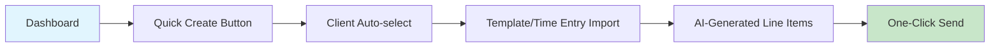
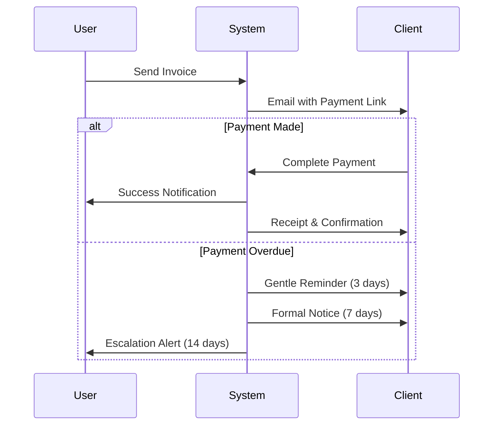

# UI/UX Strategy: InvoiceFlow Pro
## Comprehensive Design Implementation Strategy

**Document Version:** 1.0  
**Date:** January 2025  
**Status:** Implementation Ready  
**Author:** Senior UI/UX Strategist & Design Systems Expert

---

## Executive Summary

InvoiceFlow Pro requires a sophisticated yet intuitive design system that balances professional credibility with ease of use. The strategy focuses on mobile-first responsive design, AI-driven interface intelligence, and seamless workflow optimization to serve three distinct user personas across freelance, consulting, and agency contexts.

### Strategic Design Goals
1. **Speed**: Invoice creation in <30 seconds
2. **Intelligence**: AI-powered interface suggestions and automation
3. **Accessibility**: WCAG 2.1 Level AA compliance
4. **Credibility**: Professional branding that enhances freelancer reputation
5. **Scalability**: Design system that grows from solo to team use

---

## 1. Design Strategy Development

### 1.1 Brand Positioning & Visual Identity

#### Brand Personality
- **Professional yet Approachable**: Clean, modern design that inspires confidence
- **Intelligent**: AI-powered features feel magical, not overwhelming
- **Efficient**: Every interaction optimized for speed and clarity
- **Trustworthy**: Financial interfaces require absolute clarity and security

#### Visual Design Direction
**Primary Brand Palette:**
- **Trust Blue**: `#0066FF` - Primary CTA buttons, key metrics, invoice status
- **Success Green**: `#00C853` - Payment confirmations, positive metrics, health scores
- **Premium Purple**: `#7C3AED` - AI features, premium indicators, insights
- **Warning Amber**: `#F59E0B` - Overdue notices, attention items
- **Error Red**: `#EF4444` - Critical alerts, failed payments
- **Neutral Grays**: `#F8FAFC` to `#0F172A` - 9-step semantic scale

**Typography System:**
- **Headlines**: Inter (700/600/500) - Clean, modern, excellent readability
- **Body Text**: IBM Plex Sans (400/500) - Professional, optimized for financial data
- **Monospace**: IBM Plex Mono - Invoice numbers, amounts, timestamps
- **Scale**: 12px/14px/16px/18px/20px/24px/32px/40px/48px

**Spatial System:**
- **Base Unit**: 4px grid system
- **Spacing Scale**: 4, 8, 12, 16, 20, 24, 32, 40, 48, 64, 80px
- **Border Radius**: 6px (inputs), 8px (cards), 12px (modals), 16px (containers)
- **Shadows**: Layered depth system for hierarchy

### 1.2 User Experience Architecture

#### Information Architecture
```
Dashboard (Overview)
├── Quick Actions (Floating)
├── Revenue Metrics (Cards)
├── Recent Invoices (Table)
├── Payment Timeline (Chart)
└── AI Insights (Sidebar)

Invoice Management
├── All Invoices (Filterable list)
├── Draft Invoices (Quick edit)
├── Recurring Templates
└── Invoice Analytics

Client Management
├── Client Directory
├── Client Health Scores
├── Payment History
└── Communication Log

Time & Expense
├── Timer Interface
├── Manual Entry
├── Expense Capture
└── Project Tracking

Reports & Analytics
├── Revenue Reports
├── Tax Summaries
├── Client Analytics
└── Performance Metrics

Settings & Configuration
├── Profile & Branding
├── Payment Settings
├── Automation Rules
└── Team Management
```

#### Navigation Strategy
- **Primary Navigation**: Persistent sidebar (desktop) / bottom tabs (mobile)
- **Secondary Actions**: Contextual toolbars and quick action buttons
- **Breadcrumbs**: Multi-level navigation for complex workflows
- **Search**: Global search with smart filtering and AI suggestions

### 1.3 Persona-Driven Design Decisions

#### Sarah the Designer (Primary Persona)
**Design Priorities:**
- Visual appeal and customization options
- Quick template-based invoice creation
- Intuitive time tracking integration
- Clear payment status visualization

**Specific UX Considerations:**
- Drag-and-drop invoice builder
- Custom branding controls
- Visual time tracking dashboard
- One-click template application

#### Marcus the Consultant (Secondary Persona)
**Design Priorities:**
- Professional reporting capabilities
- Multi-currency clarity
- Complex project tracking
- Enterprise-grade security visuals

**Specific UX Considerations:**
- Detailed project breakdown views
- Currency conversion displays
- Approval workflow indicators
- Professional PDF generation

#### Alex the Dev Agency (Tertiary Persona)
**Design Priorities:**
- Team collaboration interfaces
- Technical integration displays
- Performance analytics
- Scalable permission management

**Specific UX Considerations:**
- Team activity feeds
- Role-based interface variations
- API integration status displays
- Revenue sharing visualizations

---

## 2. Component System Planning

### 2.1 Core Component Library (Extending shadcn/ui)

#### Enhanced Form Components
```typescript
// Invoice Builder Components
<InvoiceBuilder />
  ├── <ClientSelector /> // Autocomplete with smart suggestions
  ├── <LineItemEditor /> // Drag-drop reordering, smart calculations
  ├── <TaxCalculator /> // Multi-jurisdiction tax handling
  ├── <PaymentTermsSelector /> // Visual timeline picker
  └── <PreviewPanel /> // Real-time PDF preview

// Financial Input Components
<CurrencyInput /> // Multi-currency with conversion
<PercentageInput /> // Tax rates, discounts
<DurationInput /> // Time tracking, payment terms
<DateRangeSelector /> // Reporting periods, project timelines

// Status & Progress Components
<PaymentTimeline /> // Visual payment journey
<HealthScoreBadge /> // Client health indicators
<ProgressMeter /> // Project completion, payment progress
<StatusIndicator /> // Invoice states with clear iconography
```

#### Data Visualization Components
```typescript
// Chart Components
<RevenueChart /> // Monthly revenue trends
<PaymentFlowChart /> // Cash flow visualization
<ClientPerformanceChart /> // Payment timing analytics
<ProjectProfitabilityChart /> // ROI visualization

// Table Components
<InvoiceTable /> // Enhanced data table with actions
<ClientDirectory /> // Sortable, filterable client list
<TimeEntryTable /> // Detailed time tracking records
<ExpenseTable /> // Receipt integration and categorization

// Dashboard Widgets
<MetricCard /> // KPI displays with trend indicators
<QuickActionGrid /> // Fast access to common tasks
<NotificationCenter /> // Payment alerts, AI insights
<AIInsightPanel /> // Predictive analytics display
```

#### Invoice-Specific Components
```typescript
// Invoice Creation & Management
<InvoicePreview /> // PDF-accurate preview
<TemplateSelector /> // Visual template gallery
<RecurringRuleBuilder /> // Complex recurrence patterns
<PaymentMethodDisplay /> // Client payment options

// Client Portal Components
<ClientDashboard /> // Self-service interface
<PaymentInterface /> // Stripe-integrated checkout
<InvoiceHistory /> // Client-facing invoice archive
<DisputeInterface /> // Query and resolution system

// Time Tracking Components
<TimerWidget /> // Start/stop with project selection
<TimesheetCalendar /> // Visual time entry interface
<ExpenseCapture /> // Camera integration for receipts
<MileageTracker /> // GPS-based distance calculation
```

### 2.2 Advanced Interaction Patterns

#### AI-Enhanced Interfaces
- **Smart Suggestions**: Context-aware autocomplete for all inputs
- **Predictive Text**: Invoice descriptions based on project history
- **Anomaly Highlights**: Visual indicators for unusual patterns
- **Optimization Hints**: Subtle suggestions for better workflows

#### Micro-Interactions & Animations
- **Success Celebrations**: Payment confirmation animations
- **Progress Feedback**: Real-time calculation updates
- **Loading States**: Skeleton screens during AI processing
- **State Transitions**: Smooth status change animations

#### Gesture & Touch Interactions
- **Swipe Actions**: Quick invoice actions on mobile
- **Pull-to-Refresh**: Update payment statuses
- **Long Press**: Context menus for bulk actions
- **Drag Gestures**: Reorder line items, organize clients

---

## 3. Mobile-First Responsive Strategy

### 3.1 Responsive Breakpoint Strategy

#### Breakpoint System
```css
/* Mobile First Approach */
:root {
  --breakpoint-xs: 320px;  /* Small phones */
  --breakpoint-sm: 640px;  /* Large phones */
  --breakpoint-md: 768px;  /* Tablets */
  --breakpoint-lg: 1024px; /* Small laptops */
  --breakpoint-xl: 1280px; /* Desktop */
  --breakpoint-2xl: 1536px; /* Large screens */
}
```

#### Layout Adaptations
**Mobile (320px-640px):**
- Single-column layouts
- Bottom sheet modals
- Swipe-based navigation
- Thumb-friendly touch targets (44px minimum)
- Collapsible sections to reduce scroll

**Tablet (640px-1024px):**
- Two-column layouts where appropriate
- Side panel navigation
- Larger touch targets
- Multi-task viewing capabilities

**Desktop (1024px+):**
- Multi-column layouts
- Persistent sidebars
- Hover states and tooltips
- Keyboard navigation support
- Dense data displays

### 3.2 Mobile-Specific Features

#### Progressive Web App (PWA) Capabilities
- **Offline Mode**: Cache invoices for offline viewing/editing
- **Push Notifications**: Payment alerts, reminder notifications
- **Home Screen Install**: Native app-like experience
- **Background Sync**: Auto-sync when connection restored

#### Mobile-Optimized Workflows
- **Quick Invoice**: Streamlined 3-step creation process
- **Voice Input**: Dictate invoice descriptions and notes
- **Camera Integration**: Receipt capture with OCR processing
- **Location Services**: Automatic mileage tracking

#### Touch-First Interactions
- **Swipe Actions**: Left/right swipes for common actions
- **Pull Gestures**: Refresh data, load more content
- **Haptic Feedback**: Confirmation vibrations for important actions
- **Edge Navigation**: Gestures for back/forward navigation

---

## 4. Accessibility Implementation Strategy

### 4.1 WCAG 2.1 Level AA Compliance

#### Visual Accessibility
**Color Contrast Requirements:**
- Normal text: 4.5:1 minimum contrast ratio
- Large text: 3:1 minimum contrast ratio
- Interactive elements: Clear focus indicators
- Error states: Color + icon + text redundancy

**Typography Accessibility:**
- Scalable text up to 200% without horizontal scrolling
- Clear font choices optimized for readability
- Sufficient line height (1.5x) and letter spacing
- No text in images except logos

#### Interaction Accessibility
**Keyboard Navigation:**
- Tab order follows logical reading flow
- All interactive elements keyboard accessible
- Skip links for main content areas
- Visible focus indicators with high contrast

**Screen Reader Support:**
- Semantic HTML structure
- ARIA labels for complex interactions
- Live regions for dynamic content updates
- Descriptive alt text for meaningful images

#### Cognitive Accessibility
**Clear Information Architecture:**
- Consistent navigation patterns
- Descriptive headings and labels
- Error prevention and clear error messages
- Multiple ways to access the same information

### 4.2 Assistive Technology Support

#### Screen Reader Optimization
```typescript
// Example: Invoice Status Announcement
<div 
  role="status" 
  aria-live="polite"
  aria-label={`Invoice ${invoiceNumber} status updated to ${status}`}
>
  <StatusBadge status={status} />
</div>

// Complex Data Tables
<table role="table" aria-label="Invoice list">
  <thead>
    <tr>
      <th scope="col" aria-sort="ascending">Invoice Number</th>
      <th scope="col">Client</th>
      <th scope="col">Amount</th>
      <th scope="col">Status</th>
      <th scope="col">Actions</th>
    </tr>
  </thead>
  <tbody>
    {invoices.map(invoice => (
      <tr key={invoice.id}>
        <td>{invoice.number}</td>
        <td>{invoice.client.name}</td>
        <td>
          <span aria-label={`Amount: ${formatCurrency(invoice.total)}`}>
            {formatCurrency(invoice.total)}
          </span>
        </td>
        <td>
          <StatusBadge 
            status={invoice.status}
            aria-label={`Status: ${invoice.status}`}
          />
        </td>
        <td>
          <ActionMenu 
            invoice={invoice}
            aria-label={`Actions for invoice ${invoice.number}`}
          />
        </td>
      </tr>
    ))}
  </tbody>
</table>
```

#### High Contrast & Low Vision Support
- **High Contrast Mode**: Alternative color scheme option
- **Text Scaling**: Support for browser zoom up to 400%
- **Focus Enhancement**: Extra-visible focus indicators
- **Motion Reduction**: Respect prefers-reduced-motion

---

## 5. Critical User Flow Optimizations

### 5.1 30-Second Invoice Creation Flow

#### Optimized Creation Process


**Step 1: Intelligent Entry Point (2 seconds)**
- Floating action button always visible
- Recent client suggestions based on activity
- Template quick-select carousel

**Step 2: Smart Client Selection (3 seconds)**
- Autocomplete with fuzzy search
- Recent clients prioritized
- New client quick-add modal

**Step 3: Automated Content Generation (10 seconds)**
- Import from time tracking with one click
- AI-suggested line items based on client history
- Automatic tax calculation based on jurisdictions

**Step 4: Real-time Preview (10 seconds)**
- Live PDF preview as user types
- Instant total calculations
- Smart default values (terms, due dates)

**Step 5: Send & Track (5 seconds)**
- One-click send with delivery confirmation
- Automatic payment reminder scheduling
- Dashboard metric updates

### 5.2 Payment Tracking & Follow-up Flow

#### Automated Payment Journey


#### Visual Payment Timeline
- **Progress Indicator**: Clear payment journey visualization
- **Status Updates**: Real-time notifications with context
- **Predictive Insights**: AI-powered payment date predictions
- **Action Triggers**: Smart reminder customization

### 5.3 Time-to-Invoice Workflow

#### Seamless Tracking Integration
**Time Entry → Invoice Flow:**
1. **Time Tracking Interface**: Visual project timers
2. **Entry Review**: Weekly timesheet approval
3. **Billable Selection**: Filter and categorize entries
4. **Smart Grouping**: Automatic project/task organization
5. **Invoice Generation**: One-click conversion to invoice

**Optimization Features:**
- **Bulk Actions**: Select multiple entries for invoicing
- **Rate Management**: Client-specific and project-specific rates
- **Description Enhancement**: AI-improved task descriptions
- **Rounding Rules**: Configurable time rounding preferences

---

## 6. Design System Specifications

### 6.1 Component Token System

#### Color Tokens
```css
:root {
  /* Brand Colors */
  --color-primary-50: #eff6ff;
  --color-primary-500: #0066ff;
  --color-primary-900: #1e3a8a;
  
  /* Semantic Colors */
  --color-success-50: #f0fdf4;
  --color-success-500: #00c853;
  --color-success-900: #14532d;
  
  --color-warning-50: #fffbeb;
  --color-warning-500: #f59e0b;
  --color-warning-900: #92400e;
  
  --color-error-50: #fef2f2;
  --color-error-500: #ef4444;
  --color-error-900: #991b1b;
  
  /* Neutral Grays */
  --color-gray-50: #f8fafc;
  --color-gray-100: #f1f5f9;
  --color-gray-200: #e2e8f0;
  --color-gray-300: #cbd5e1;
  --color-gray-400: #94a3b8;
  --color-gray-500: #64748b;
  --color-gray-600: #475569;
  --color-gray-700: #334155;
  --color-gray-800: #1e293b;
  --color-gray-900: #0f172a;
}
```

#### Typography Tokens
```css
:root {
  /* Font Families */
  --font-sans: 'Inter', -apple-system, BlinkMacSystemFont, sans-serif;
  --font-mono: 'IBM Plex Mono', 'Menlo', 'Monaco', monospace;
  
  /* Font Sizes */
  --text-xs: 0.75rem;     /* 12px */
  --text-sm: 0.875rem;    /* 14px */
  --text-base: 1rem;      /* 16px */
  --text-lg: 1.125rem;    /* 18px */
  --text-xl: 1.25rem;     /* 20px */
  --text-2xl: 1.5rem;     /* 24px */
  --text-3xl: 2rem;       /* 32px */
  --text-4xl: 2.5rem;     /* 40px */
  
  /* Font Weights */
  --font-normal: 400;
  --font-medium: 500;
  --font-semibold: 600;
  --font-bold: 700;
  
  /* Line Heights */
  --leading-tight: 1.25;
  --leading-normal: 1.5;
  --leading-relaxed: 1.75;
}
```

#### Spacing & Layout Tokens
```css
:root {
  /* Spacing Scale */
  --space-1: 0.25rem;   /* 4px */
  --space-2: 0.5rem;    /* 8px */
  --space-3: 0.75rem;   /* 12px */
  --space-4: 1rem;      /* 16px */
  --space-5: 1.25rem;   /* 20px */
  --space-6: 1.5rem;    /* 24px */
  --space-8: 2rem;      /* 32px */
  --space-10: 2.5rem;   /* 40px */
  --space-12: 3rem;     /* 48px */
  --space-16: 4rem;     /* 64px */
  --space-20: 5rem;     /* 80px */
  
  /* Border Radius */
  --radius-sm: 0.375rem;  /* 6px */
  --radius: 0.5rem;       /* 8px */
  --radius-lg: 0.75rem;   /* 12px */
  --radius-xl: 1rem;      /* 16px */
  
  /* Shadows */
  --shadow-sm: 0 1px 2px rgba(0, 0, 0, 0.05);
  --shadow: 0 1px 3px rgba(0, 0, 0, 0.1), 0 1px 2px rgba(0, 0, 0, 0.06);
  --shadow-lg: 0 10px 15px rgba(0, 0, 0, 0.1), 0 4px 6px rgba(0, 0, 0, 0.05);
  --shadow-xl: 0 20px 25px rgba(0, 0, 0, 0.1), 0 10px 10px rgba(0, 0, 0, 0.04);
}
```

### 6.2 Component Specifications

#### Button System
```typescript
// Button Variants
interface ButtonProps {
  variant: 'primary' | 'secondary' | 'outline' | 'ghost' | 'destructive';
  size: 'sm' | 'md' | 'lg';
  isLoading?: boolean;
  leftIcon?: React.ReactNode;
  rightIcon?: React.ReactNode;
}

// Primary CTA Button
<Button variant="primary" size="lg">
  Create Invoice
</Button>

// Secondary Actions
<Button variant="outline" size="md" leftIcon={<PlusIcon />}>
  Add Client
</Button>

// Destructive Actions
<Button variant="destructive" size="sm">
  Delete Invoice
</Button>
```

#### Form Input System
```typescript
// Enhanced Input Components
<CurrencyInput
  value={amount}
  currency="USD"
  onValueChange={setAmount}
  placeholder="0.00"
  showCurrencySymbol
  allowNegative={false}
/>

<DateInput
  value={dueDate}
  onChange={setDueDate}
  minDate={new Date()}
  placeholder="Select due date"
  presets={[
    { label: 'Net 15', value: addDays(new Date(), 15) },
    { label: 'Net 30', value: addDays(new Date(), 30) },
    { label: 'Net 60', value: addDays(new Date(), 60) },
  ]}
/>

<ClientSelector
  value={selectedClient}
  onChange={setSelectedClient}
  onCreateNew={(name) => createClient(name)}
  placeholder="Search or create client..."
  showRecentClients
/>
```

#### Status & Feedback System
```typescript
// Status Indicators
<StatusBadge status="paid" variant="success">
  Paid
</StatusBadge>

<StatusBadge status="overdue" variant="error">
  Overdue
</StatusBadge>

<StatusBadge status="draft" variant="neutral">
  Draft
</StatusBadge>

// Progress Indicators
<PaymentProgress 
  current={2500} 
  total={5000} 
  showPercentage 
  colorScheme="success"
/>

// Health Score Display
<HealthScore 
  score={85} 
  label="Excellent" 
  trend="improving"
  details="Usually pays within 5 days"
/>
```

### 6.3 Animation & Interaction Guidelines

#### Micro-Animation Principles
```css
/* Smooth Transitions */
.smooth-transition {
  transition: all 0.2s cubic-bezier(0.4, 0, 0.2, 1);
}

/* Hover States */
.interactive-element:hover {
  transform: translateY(-1px);
  box-shadow: var(--shadow-lg);
}

/* Loading States */
.loading-skeleton {
  background: linear-gradient(
    90deg,
    var(--color-gray-200) 25%,
    var(--color-gray-100) 50%,
    var(--color-gray-200) 75%
  );
  background-size: 200% 100%;
  animation: loading 1.5s infinite;
}

@keyframes loading {
  0% { background-position: 200% 0; }
  100% { background-position: -200% 0; }
}

/* Success Celebrations */
.success-celebration {
  animation: celebration 0.6s ease-out;
}

@keyframes celebration {
  0% { transform: scale(1); }
  50% { transform: scale(1.05); }
  100% { transform: scale(1); }
}
```

---

## 7. Asset Coordination Strategy

### 7.1 Brand Asset Development Plan

#### Logo & Brand Identity
**Requirements:**
- Primary logo (horizontal, vertical, mark-only versions)
- Color and monochrome variations
- Minimum size specifications (16px for favicon)
- Clear space guidelines
- Usage guidelines for freelancer white-labeling

**File Formats Needed:**
- SVG (scalable, web-optimized)
- PNG (high-resolution for print)
- ICO (favicon)
- WebP (optimized web format)

#### Icon System Development
**Icon Categories Required:**
- **Financial**: Invoice, payment, expense, tax, currency symbols
- **Status**: Success, warning, error, pending, overdue indicators
- **Actions**: Create, edit, delete, send, download, share
- **Navigation**: Dashboard, clients, reports, settings, help
- **Features**: Timer, camera, AI insights, automation, integrations

**Icon Specifications:**
- **Style**: Outline style for consistency with brand
- **Grid**: 24x24px base grid
- **Stroke**: 1.5px consistent stroke width
- **Corner Radius**: 2px for consistency
- **Formats**: SVG with React component exports

### 7.2 Visual Asset Library

#### Illustration Strategy
**Illustration Types:**
- **Empty States**: Friendly illustrations for no data scenarios
- **Error States**: Helpful problem-solving illustrations
- **Onboarding**: Step-by-step visual guides
- **Feature Explanations**: Complex feature visualization
- **Success States**: Celebration and confirmation illustrations

**Style Guidelines:**
- **Color Palette**: Limited to brand colors
- **Style**: Minimalist line art with selective color fills
- **Mood**: Professional yet approachable
- **Scalability**: Vector-based for all screen sizes

#### Photography Guidelines
**Image Requirements:**
- **User Avatars**: Default avatar system and guidelines
- **Profile Images**: Aspect ratio and size guidelines
- **Receipt Images**: OCR-optimized capture guidelines
- **Background Images**: Subtle patterns for visual interest

### 7.3 Figma Agent Coordination Plan

#### Asset Extraction Strategy
**figma-asset-extractor Coordination:**
1. **Icon Export**: Batch export of icon system in multiple formats
2. **Logo Variants**: All brand variations and specifications
3. **Color Palette**: Exact hex values and usage guidelines
4. **Typography**: Font files and usage specifications
5. **Component Exports**: Design system component documentation

#### Design Token Integration
**design-token-extractor Requirements:**
1. **Color Tokens**: CSS custom properties generation
2. **Typography Tokens**: Font size, weight, and line height scales
3. **Spacing Tokens**: Consistent spacing system
4. **Shadow Tokens**: Layered depth system
5. **Border Radius Tokens**: Consistent corner radius system

#### Component Library Mapping
**figma-to-shadcn-conversion-map Tasks:**
1. **Base Components**: Map Figma components to shadcn/ui equivalents
2. **Custom Components**: Identify components requiring custom development
3. **Variant Mapping**: Ensure design variants match coded variants
4. **State Mapping**: Hover, focus, disabled, and loading states
5. **Responsive Specifications**: Mobile, tablet, and desktop variations

---

## 8. Performance & Technical Considerations

### 8.1 Performance Optimization Strategy

#### Critical Rendering Path
**Performance Targets:**
- **First Contentful Paint**: <1.2 seconds
- **Largest Contentful Paint**: <1.5 seconds
- **Time to Interactive**: <2.0 seconds
- **Invoice Generation**: <2.0 seconds
- **Search Response**: <100ms

**Optimization Techniques:**
```typescript
// Code Splitting for Route-based Loading
const InvoiceModule = lazy(() => import('./pages/InvoiceModule'));
const ClientModule = lazy(() => import('./pages/ClientModule'));
const ReportsModule = lazy(() => import('./pages/ReportsModule'));

// Component-level Code Splitting
const InvoiceBuilder = lazy(() => import('./components/InvoiceBuilder'));
const AIInsights = lazy(() => import('./components/AIInsights'));

// Image Optimization
const OptimizedImage = ({ src, alt, ...props }) => (
  <Image
    src={src}
    alt={alt}
    loading="lazy"
    placeholder="blur"
    blurDataURL="data:image/jpeg;base64,..."
    {...props}
  />
);

// PDF Generation Optimization
const generateInvoicePDF = useMemo(() => 
  throttle(async (invoiceData) => {
    const pdf = await import('./utils/pdfGenerator');
    return pdf.generateInvoice(invoiceData);
  }, 1000)
, []);
```

#### Resource Loading Strategy
**Critical Resources:**
- Inline critical CSS for above-the-fold content
- Preload key fonts (Inter, IBM Plex Sans)
- Prefetch likely navigation targets
- Service worker for offline capabilities

**Non-Critical Resources:**
- Lazy load below-the-fold images
- Defer non-essential JavaScript
- Progressive loading for large data sets
- Background sync for data updates

### 8.2 Mobile Performance Optimization

#### Touch Performance
```css
/* Optimize Touch Interactions */
.touch-target {
  min-height: 44px;
  min-width: 44px;
  touch-action: manipulation;
}

/* Reduce Paint Operations */
.animated-element {
  will-change: transform;
  transform: translateZ(0);
}

/* Optimize Scrolling */
.scroll-container {
  -webkit-overflow-scrolling: touch;
  overflow-scrolling: touch;
}
```

#### Battery & Data Optimization
- **Reduce Animation Complexity**: Respect `prefers-reduced-motion`
- **Optimize Images**: WebP format with fallbacks
- **Minimize Network Requests**: Bundle common assets
- **Cache Strategy**: Aggressive caching for static assets

---

## 9. Implementation Timeline & Milestones

### 9.1 Design Phase Timeline (8 Weeks)

#### Week 1-2: Foundation & Research
**Deliverables:**
- [ ] Brand identity finalization
- [ ] Design system token definition
- [ ] User journey mapping completion
- [ ] Accessibility audit checklist
- [ ] Competitive UX analysis

**Dependencies:**
- PRD approval and sign-off
- Stakeholder interviews completion
- Technical architecture review

#### Week 3-4: Component Design & Prototyping
**Deliverables:**
- [ ] Core component library (20+ components)
- [ ] Invoice creation flow prototype
- [ ] Dashboard layout and interactions
- [ ] Mobile responsive variants
- [ ] Accessibility implementation guide

**Dependencies:**
- Design system approval
- Development environment setup
- Figma workspace organization

#### Week 5-6: Advanced Features & Flows
**Deliverables:**
- [ ] AI insights interface design
- [ ] Client portal user experience
- [ ] Payment tracking visualizations
- [ ] Time tracking interface
- [ ] Reporting dashboard layouts

**Dependencies:**
- Component library completion
- User testing feedback integration
- Technical feasibility confirmation

#### Week 7-8: Testing & Refinement
**Deliverables:**
- [ ] Usability testing completion
- [ ] Accessibility testing results
- [ ] Performance optimization recommendations
- [ ] Developer handoff documentation
- [ ] Design QA checklist

**Dependencies:**
- Prototype completion
- Stakeholder review cycles
- Developer collaboration sessions

### 9.2 Development Handoff Strategy

#### Documentation Package
**Design Specifications:**
- Component behavior documentation
- Interaction state definitions
- Animation timing and easing specifications
- Responsive breakpoint behaviors
- Error state handling guidelines

**Asset Package:**
- Icon library (SVG + React components)
- Logo variations and usage guidelines
- Color palette (CSS custom properties)
- Typography specifications
- Illustration library

**Prototype Package:**
- Interactive Figma prototypes
- User flow documentation
- Edge case scenario handling
- Accessibility implementation notes
- Performance optimization guidelines

#### Quality Assurance Plan
**Design QA Checklist:**
- [ ] Visual accuracy to design specifications
- [ ] Responsive behavior across all breakpoints
- [ ] Accessibility compliance verification
- [ ] Performance target achievement
- [ ] Cross-browser compatibility testing
- [ ] Mobile device testing
- [ ] Loading state implementation
- [ ] Error state handling
- [ ] Animation performance testing
- [ ] Touch interaction optimization

---

## 10. Risk Mitigation & Contingencies

### 10.1 Design Risks & Mitigation

#### User Adoption Risks
**Risk**: Complex interface overwhelming new users
**Mitigation**: 
- Progressive disclosure of advanced features
- Comprehensive onboarding flow
- Contextual help system
- Simplified "easy mode" toggle

**Risk**: Mobile experience inadequacy
**Mitigation**:
- Mobile-first design approach
- Dedicated mobile user testing
- Progressive Web App implementation
- Touch-optimized interactions

#### Technical Implementation Risks
**Risk**: Performance degradation with large datasets
**Mitigation**:
- Virtual scrolling for large lists
- Pagination and lazy loading
- Data visualization optimization
- Progressive data loading

**Risk**: Cross-browser compatibility issues
**Mitigation**:
- CSS feature detection and fallbacks
- Polyfills for newer features
- Comprehensive browser testing matrix
- Graceful degradation strategy

### 10.2 Accessibility Compliance Risks

#### Legal Compliance
**Risk**: ADA/WCAG non-compliance leading to legal issues
**Mitigation**:
- Regular accessibility audits
- Automated testing integration
- User testing with assistive technologies
- Legal review of accessibility implementation

#### Technical Accessibility
**Risk**: Dynamic content accessibility failures
**Mitigation**:
- ARIA live regions for dynamic updates
- Keyboard navigation testing
- Screen reader testing protocols
- Focus management system implementation

---

## 11. Success Metrics & KPIs

### 11.1 Design Performance Metrics

#### User Experience Metrics
- **Task Completion Rate**: >95% for core workflows
- **Invoice Creation Time**: <30 seconds average
- **User Error Rate**: <2% for critical paths
- **Help Documentation Usage**: <10% of sessions
- **Feature Discovery Rate**: >60% for key features

#### Technical Performance Metrics
- **Page Load Speed**: <1.5 seconds (P95)
- **Mobile Performance Score**: >90 (Lighthouse)
- **Accessibility Score**: 100% (axe-core)
- **Cross-browser Compatibility**: 100% for target browsers
- **PWA Audit Score**: >90

#### Engagement Metrics
- **Daily Active Usage**: >60% of registered users
- **Feature Adoption Rate**: >40% for advanced features
- **Mobile Usage Percentage**: >50% of sessions
- **User Retention Rate**: >80% after 30 days
- **Customer Satisfaction Score**: >4.5/5

### 11.2 Conversion & Business Impact

#### Conversion Optimization
- **Sign-up Conversion**: >5% from landing page
- **Trial-to-Paid Conversion**: >15% within 30 days
- **Feature Upgrade Rate**: >25% to higher tiers
- **Referral Generation**: >10% of users refer others

#### User Efficiency Gains
- **Time Savings**: 70% reduction in invoicing time
- **Payment Speed Improvement**: 5-day average improvement
- **Error Reduction**: 90% fewer invoice errors
- **Automation Adoption**: 90% of eligible invoices automated

---

## 12. Conclusion & Next Steps

### 12.1 Strategic Summary

This comprehensive UI/UX strategy positions InvoiceFlow Pro as a leader in freelancer-focused financial tools through:

1. **Intelligent Design**: AI-powered interfaces that learn and adapt to user behavior
2. **Mobile Excellence**: Best-in-class mobile experience for the remote workforce
3. **Accessibility Leadership**: WCAG 2.1 AA compliance setting industry standards
4. **Performance Focus**: Sub-2-second invoice generation and <1.5s page loads
5. **Scalable Architecture**: Design system that grows from solo freelancers to agencies

### 12.2 Immediate Action Items

#### Priority 1 (Week 1):
- [ ] Stakeholder alignment on design direction
- [ ] Figma workspace setup and agent coordination
- [ ] Design system token definition
- [ ] Brand identity finalization
- [ ] User research validation sessions

#### Priority 2 (Week 2-3):
- [ ] Core component library development
- [ ] Invoice creation flow prototype
- [ ] Mobile-first responsive framework
- [ ] Accessibility implementation guidelines
- [ ] Performance optimization strategy

#### Priority 3 (Week 4-6):
- [ ] Advanced feature interface design
- [ ] User testing and iteration cycles
- [ ] Developer handoff preparation
- [ ] Quality assurance framework
- [ ] Launch readiness assessment

### 12.3 Long-term Vision

InvoiceFlow Pro's design system will establish new standards for freelancer tools by balancing sophistication with simplicity. The AI-enhanced interface will make complex financial workflows feel effortless, while the accessible, mobile-first approach ensures inclusive use across all user types and devices.

The modular design system architecture will support rapid feature expansion and customization, enabling both individual freelancer branding and white-label enterprise deployments. Through careful performance optimization and user-centered design, InvoiceFlow Pro will become the definitive tool for professional freelance financial management.

---

**Document Status:** Ready for Implementation
**Next Review:** Post-Development Handoff
**Dependencies:** PRD Approval, Technical Architecture Confirmation, Stakeholder Sign-off